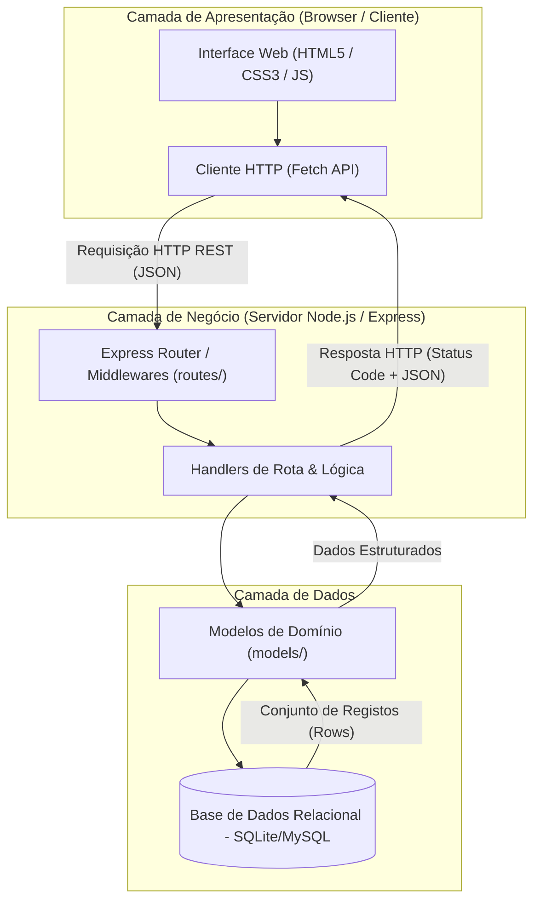

# Análise Arquitetural do ESM Forum

## a) Identificação da Arquitetura Atual

### 1. Estilo Arquitetural
O sistema ESM Forum segue uma arquitetura **Cliente-Servidor (Client-Server)** desacoplada, orientada a APIs RESTful com persistência em base de dados relacional (modelo em 3 camadas lógicas).

### 2. Camadas Existentes
* **Camada de Apresentação (Frontend):** Composta por ficheiros estáticos HTML, CSS e JavaScript client-side (localizados na pasta `public/`). É responsável pela renderização da interface com o utilizador, captura de eventos do DOM e envio de requisições assíncronas via `fetch()` para o servidor.
* **Camada de Negócio / Aplicação (Backend):** Executada em Node.js com a framework Express (`routes/`). Recebe as requisições HTTP, executa a validação preliminar dos dados, gere o ciclo de vida dos pedidos através de middlewares e invoca as operações de persistência.
* **Camada de Dados (Persistência):** Composta pelos modelos relacionais (`models/`) e pela ligação à base de dados relacional (`bd/`). Executa as instruções SQL diretas para gravação e leitura de registos persistentes.

### 3. Comunicação Frontend-Backend
A comunicação entre o cliente e o servidor dá-se de forma assíncrona sobre o protocolo **HTTP/HTTPS**, utilizando o formato padronizado **JSON (JavaScript Object Notation)** para o intercâmbio de dados nos corpos das requisições e respostas.

---

## b) Diagrama Arquitetural Atual

O diagrama abaixo ilustra os componentes em execução, as suas camadas de responsabilidade e o fluxo de dados do sistema:

Descrição do Fluxo de Dados:
O utilizador interage com a interface no navegador (ex.: envio de uma dúvida ou clique de voto).

O script do frontend dispara um pedido assíncrono via fetch() com cabeçalhos e corpo formatados em JSON.

As rotas do Express intercetam o pedido, passam pelos middlewares de tratamento de payload e validação, e acionam o respetivo manipulador.

O manipulador consulta ou persiste os dados através dos métodos do modelo, comunicando diretamente com o banco relacional via driver de persistência.

O resultado da operação é estruturado e devolvido ao navegador como uma resposta HTTP com o código de estado correspondente (200, 201, 400, etc.), sendo re-renderizado na interface do utilizador sem recarregamento de página.
