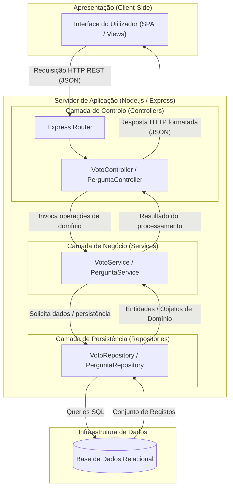

# Proposta de Melhoria Arquitetural - ESM Forum

## 1. Separação em Camadas e Aplicação do Padrão MVC

### Justificativa da Reestruturação
O sistema original do ESM Forum apresenta acoplamento direto entre rotas HTTP e regras de persistência/negócio, além de modelos que executam queries SQL diretamente. Propõe-se a transição para uma **Arquitetura em Camadas Limpas (Layered Architecture / MVC Adaptado)**:

* **View (Camada de Apresentação):** Interface SPA/web estática isolada que consome a API através de payloads estruturados em JSON.
* **Controller (Camada de Entrada / Transporte):** Recebe os pedidos HTTP, valida schemas de entrada (payload/parâmetros), despacha para o serviço competente e devolve a resposta HTTP adequada com status code.
* **Service (Camada de Negócio / Domínio):** Centraliza as regras de negócio puras (ex.: restrições de votação, cálculo de reputação, encerramento de perguntas), mantendo-se agnóstica a detalhes HTTP ou de persistência.
* **Repository (Camada de Persistência / Dados):** Isola a manipulação de queries SQL e a ligação com o motor de base de dados (SQLite/MySQL), permitindo a substituição de infraestrutura e injeção de dependência via mocks em testes unitários.

---

## 2. Diagrama da Arquitetura Proposta

O fluxo de dependência e tráfego de dados após a reestruturação é representado no diagrama abaixo:

3. Fluxo de Dados Ponta a Ponta: Mecanismo de Votação
Para ilustrar o funcionamento prático da nova arquitetura, o fluxo de uma submissão de voto ocorre da seguinte forma:

Submissão do Utilizador: O utilizador clica no botão de upvote numa pergunta na interface web. O frontend dispara um pedido POST /api/perguntas/42/voto com o corpo {"tipo": "UPVOTE"} acompanhado do token de autenticação.

Entrada e Validação HTTP: O Router interceta o pedido, valida a autenticação via middleware e repassa a requisição ao VotoController. O controller extrai os parâmetros, valida os tipos de dados e delega a ação ao método votoService.processarVoto(...).

Execução das Regras de Negócio: O VotoService consulta se a pergunta existe e se o autor é diferente do votante através do repositório. Em seguida, verifica o registo de voto anterior:

Se não existir voto, calcula o acréscimo de +1 ponto.

Se o voto for idêntico, cancela o voto e deduz 1 ponto.

Se for oposto, atualiza o registo e ajusta o diferencial de 2 pontos.

Persistência Isolada: O VotoRepository executa as queries parametrizadas na base de dados para atualizar a tabela votos e a tabela perguntas dentro de uma transação.

Retorno: O repositório confirma a gravação ao serviço, o serviço devolve o DTO com o novo estado ao controlador, e este responde ao cliente com status 200 OK e o JSON com a pontuação atualizada, permitindo à interface atualizar o contador de votos sem recarregar a página.
