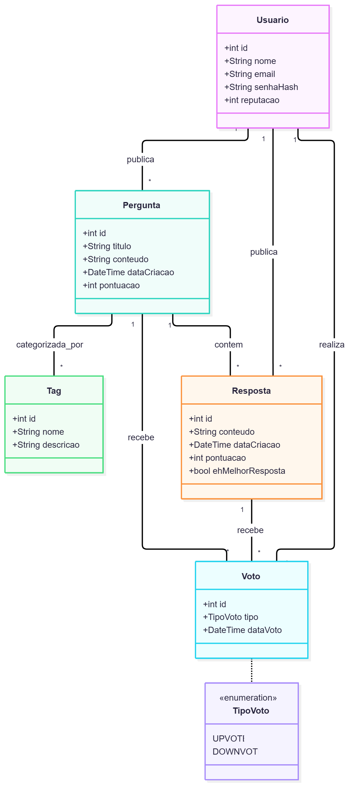
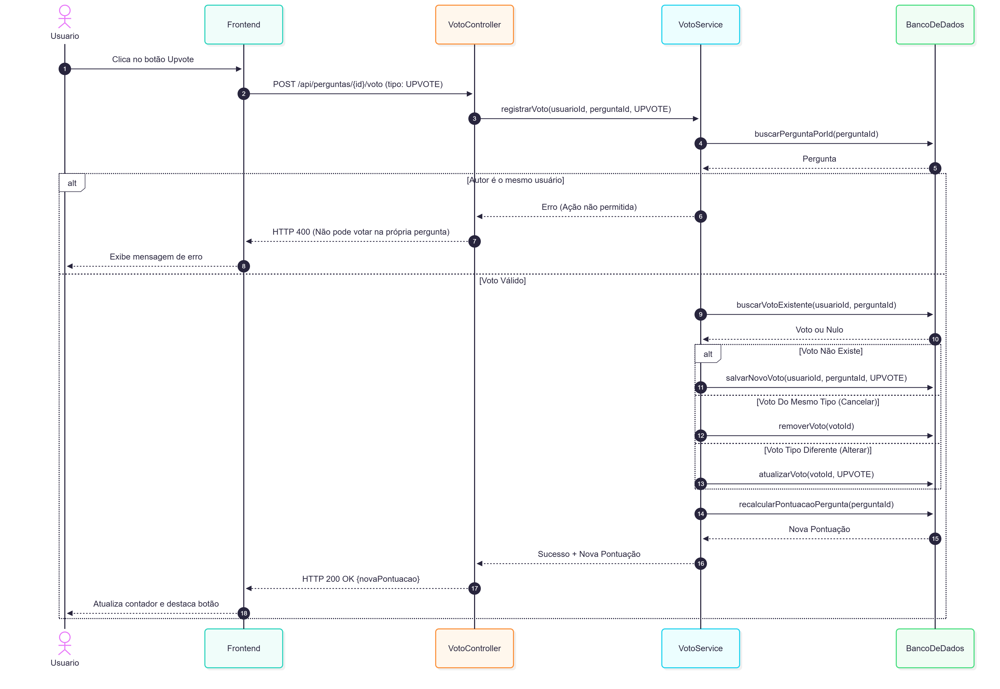
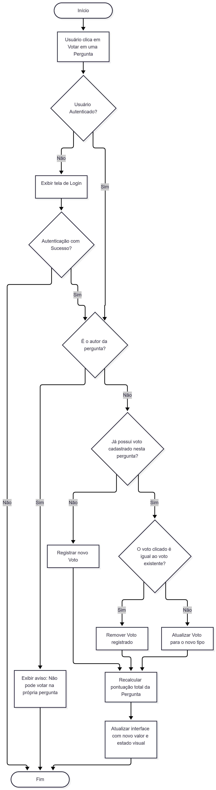
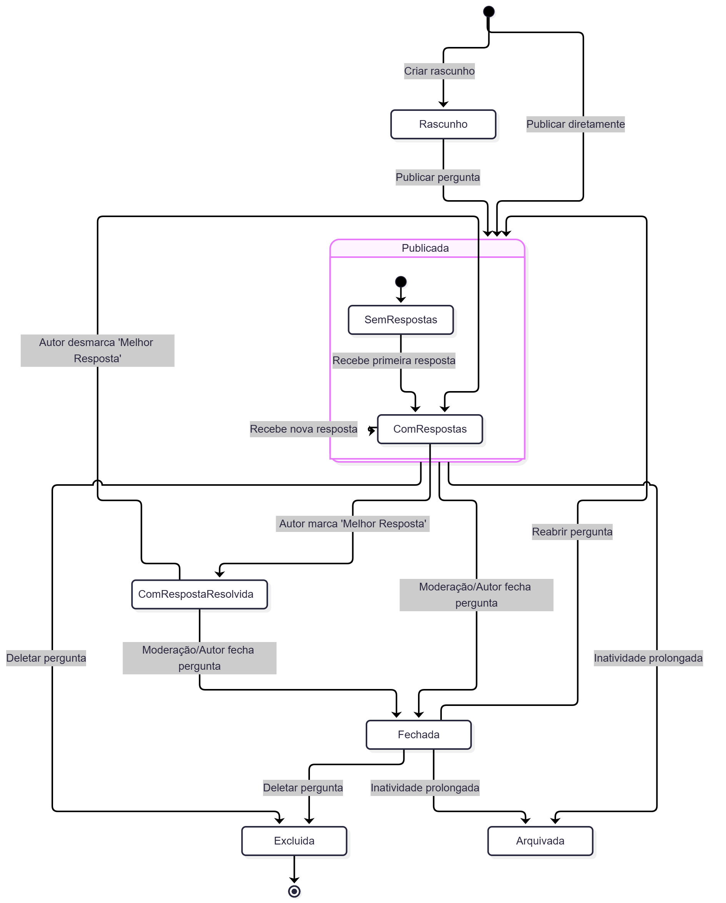

# Projeto Final - Engenharia de Software 1 (ES1)
## Sistema: ESM Forum

**Aluna:** Débora Scandola  
**Curso:** Análise e Desenvolvimento de Sistemas (ADS) - FGV  

---

## 1. Visão Geral do Sistema (Parte 1)

O **ESM Forum** é uma plataforma minimalista de perguntas e respostas desenvolvida originalmente no contexto do livro *Engenharia de Software Moderna*. O objetivo deste projeto é expandir as suas capacidades centrais através da especificação e modelagem de cinco novas funcionalidades:

1. **Sistema de Votação (Upvote / Downvote):** Curadoria colaborativa para qualificar perguntas e respostas através de saldos de votos.
2. **Marcação de Melhor Resposta:** Mecanismo exclusivo do autor da dúvida para destacar a solução aceite e encerrar o problema.
3. **Categorização por Etiquetas (Tags):** Sistema de taxonomia para organizar, sugerir e filtrar conteúdos por tópicos técnicos.
4. **Perfis de Utilizador com Histórico:** Visualização de reputação e listagem cronológica das contribuições de cada membro.
5. **Notificações em Tempo Real:** Alertas automáticos para autores quando as suas perguntas recebem novas respostas ou comentários.

---

## 2. Histórias de Usuário e Priorização (Parte 2 - Tarefa 1)

As especificações completas encontram-se documentadas no ficheiro [HISTORIAS.md](HISTORIAS.md).

| Ordem de Prioridade | História de Usuário | Justificação (Papel de Product Owner) |
| :---: | :--- | :--- |
| **1º** | **História 1: Sistema de Votação** | **Alta Prioridade**: Constitui a base da curadoria social da comunidade. Sem votação, o fórum carece de filtros de relevância e credibilidade. |
| **2º** | **História 2: Marcação de Melhor Resposta** | **Média Prioridade**: Cumpre o propósito nuclear de uma plataforma Q&A, confirmando o encerramento do problema e poupando tempo de busca. |
| **3º** | **História 3: Categorização por Tags** | **Baixa Prioridade**: Essencial para a navegabilidade em grande escala, mas secundária face ao ciclo primordial de perguntas, respostas e validação de qualidade. |

---

## 3. Caso de Uso Detalhado (Parte 2 - Tarefa 2)

O fluxo principal, alternativos e exceções referentes à funcionalidade prioritária de Votação estão detalhados em [CASO_DE_USO.md](CASO_DE_USO.md).

---

## 4. Diagramas UML (Parte 2 - Tarefa 3)

### a) Diagrama de Classes
Modela a estrutura de dados e as associações do domínio, incluindo as entidades de utilizador, perguntas, respostas, votos tipificados e categorização por tags.

---

### b) Diagrama de Sequência
Detalha a troca de mensagens síncronas e assíncronas entre os componentes arquiteturais para o Caso de Uso de Votação (Frontend, Controller, Service e Base de Dados).

---

### c) Diagrama de Atividades
Representa o fluxo lógico operacional de decisão para a funcionalidade de votação, contemplando os caminhos de login, verificação de autoria, criação, anulação e alternância de votos.

---

### d) Diagrama de Estados
Modela o ciclo de vida completo de uma `Pergunta`, desde o rascunho até à publicação, transições entre respostas recebidas, resolução definitiva, encerramento por moderação e arquivamento.

